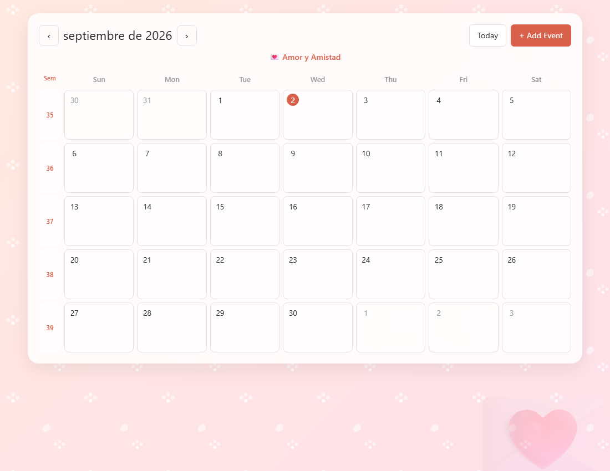
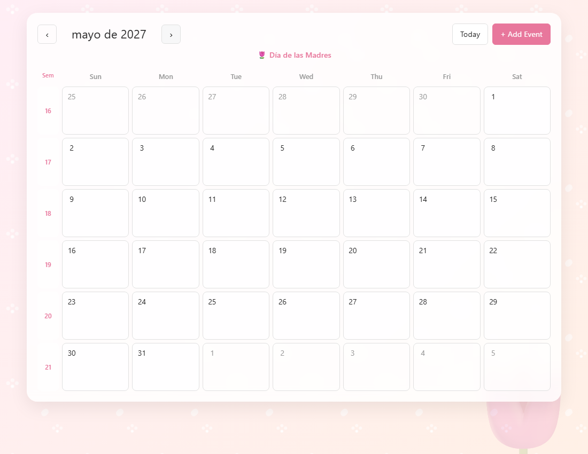
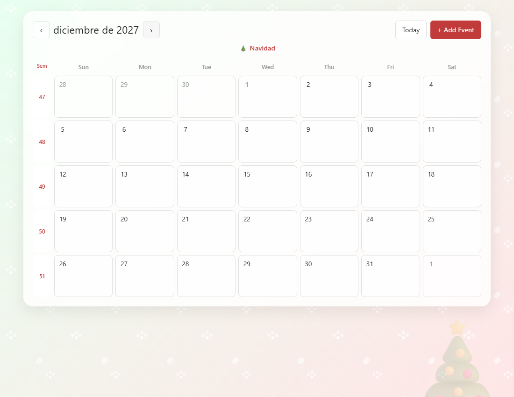
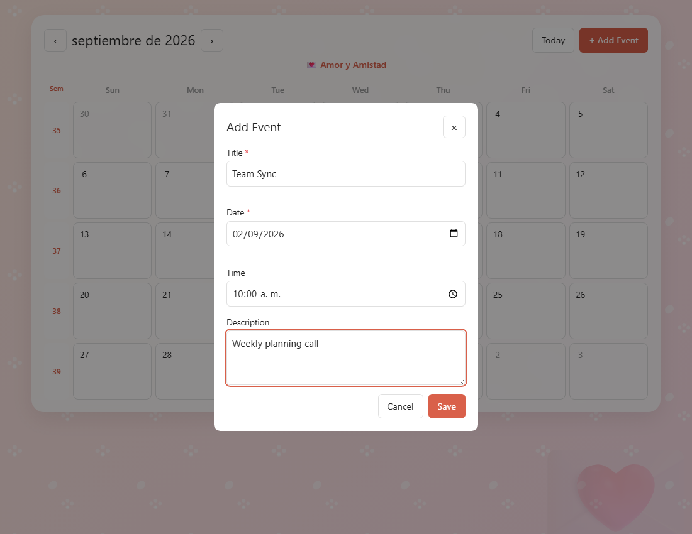
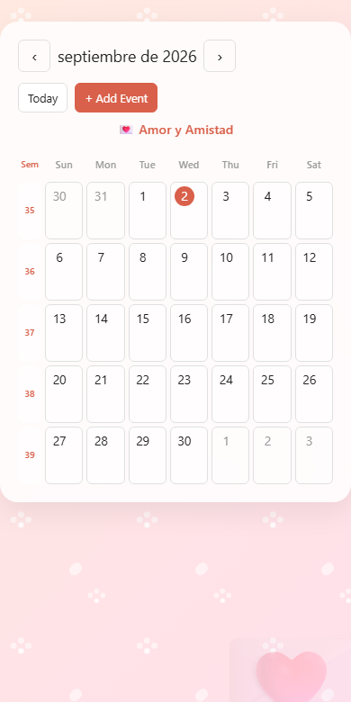

# Calendar App

A simple month-view calendar where you can add, edit, and delete events, right in your browser — no installation needed.

## Setup Instructions

This app has no build tools or dependencies — it's just plain HTML, CSS, and JavaScript
(styled with [Tailwind CSS](https://tailwindcss.com) via its Play CDN, loaded straight from
a `<script>` tag).

1. Get the files onto your computer:
   ```bash
   git clone https://github.com/danielarmacias/calendar-app-demo.git
   cd calendar-app-demo
   ```
   (Or just download/copy the `index.html` and `app.js` files.)
2. Open `index.html` in your web browser — double-click the file, or drag it into a browser window.
3. That's it! The app is running. Your events are saved in the browser's local storage, so they'll still be there next time you open the page (in the same browser).

## Screenshots

### Month view


### Monthly themed backgrounds
| May — Mother's Day | December — Christmas |
| --- | --- |
|  |  |

### Add event modal


### Mobile responsive view


## Features

- **Month view** with buttons to go to the previous/next month, and a "Today" button to jump back to the current date
- **Week numbers** shown on the left side of the calendar grid
- **A themed background each month**, with an emoji and label for a notable day (e.g. 💘 Valentine's Day in February, 🎄 Christmas in December)
- **Add, edit, and delete events** using a simple popup form
- **Events are saved automatically** in your browser, so they're still there when you reload the page
- **Form validation** — you'll see an inline message if you try to save an event without a title or date
- **Works on mobile** — the layout adjusts to smaller screens

## Example Usage

**Adding an event:**
1. Click any day on the calendar (or the "+ Add Event" button).
2. Fill in a title (required) and a date (required). Time and description are optional.
3. Click "Save". Your event now shows up on that day.

**Editing or deleting an event:**
1. Click on an existing event in the calendar.
2. Update the details and click "Save" — or click "Delete" to remove it.

**Navigating months:**
- Use the `‹` and `›` arrows to move between months.
- Click "Today" to jump back to the current month.
